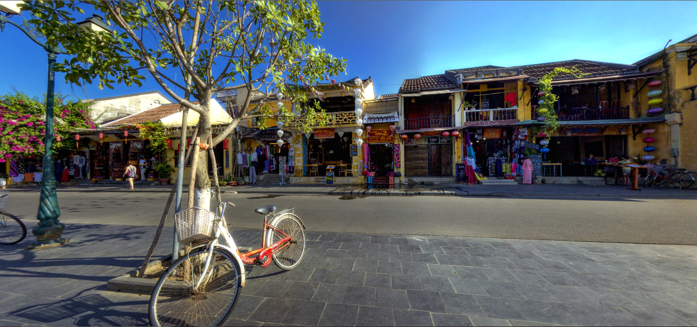
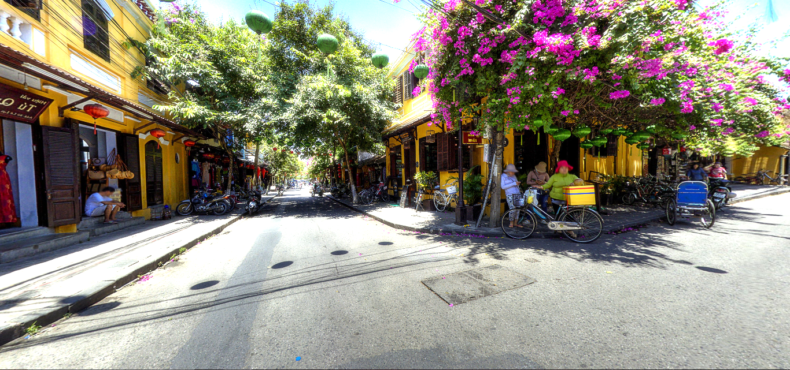

# 360 Hội AN tour Project

## Nội dung

<table>
      <tr>
        <td valign="top">
          <ul>
            <li><a href="#1-tổng-quan">1. Tổng quan.</a></li>
            <li><a href="#2-cách-cài-đặt-dự-án">2. Cách cài đặt dự án.</a></li>
            <li><a href="#3-tài-liệu-và-tham-khảo">3. Tài liệu tham khảo.</a></li>
          </ul>
        </td>
      </tr>
</table>

## 1. Tổng quan

Dự án là trải nghiệm tham quan Hội An thông qua web360. Nội dung chính của dự án từng bước thực hiện chuyển đổi số hệ thống thông tin du lịch Hội An.

Thăm quan và trải nghiệm: [Live demo](https://360tourtest.vercel.app/)

## 2. Cách cài đặt dự án

### Bước 1: Clone dự án ở repo

Lấy source code từ trên github về máy.

```
git clone https://github.com/dachieu2k2/360tourtest.git
```

### Bước 2: Cài node_modules

Tải tất cả các package cần thiết để chạy các dự án node js.

```
cd 360tourtest && npm install
```

### Bước 3: Chạy dự án

```
npm run dev
```

### Kết quả


_(Ảnh minh họa kết quả)_


_(Ảnh minh họa kết quả)_

## 3. Tài liệu và tham khảo

- Cài node js tại: [Nodejs](https://nodejs.org/en).
- Cách MQTT broker: [360 tour hội an halomedia](https://www.halomedia.vn/360tours/hoi-an-360-tour)
- React-three-fiber virtual tour: [React-three-fiber virtual tour](https://codesandbox.io/p/sandbox/sky-dome-with-annotations-wbrfs?file=%2Fsrc%2FApp.js).
- Effect Transitions: [Hover Image Transition Effect - React Three Fiber Tutorial](https://www.youtube.com/watch?v=SOF7GBmC6gE)
